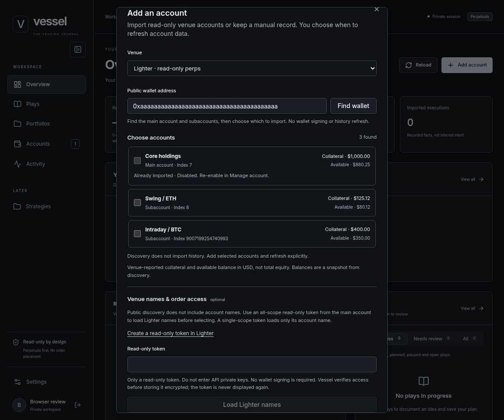
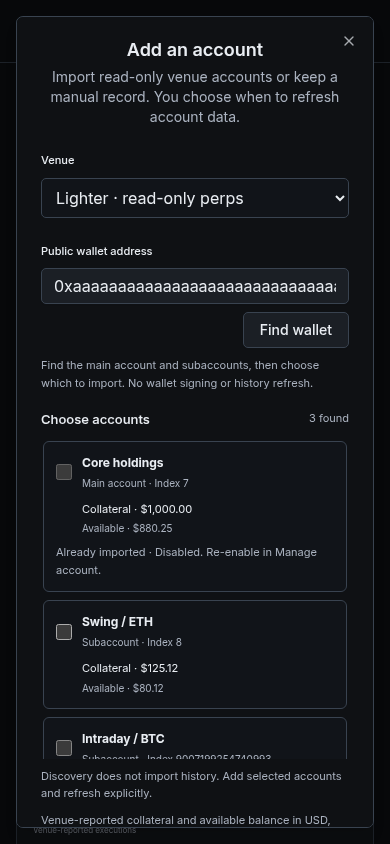
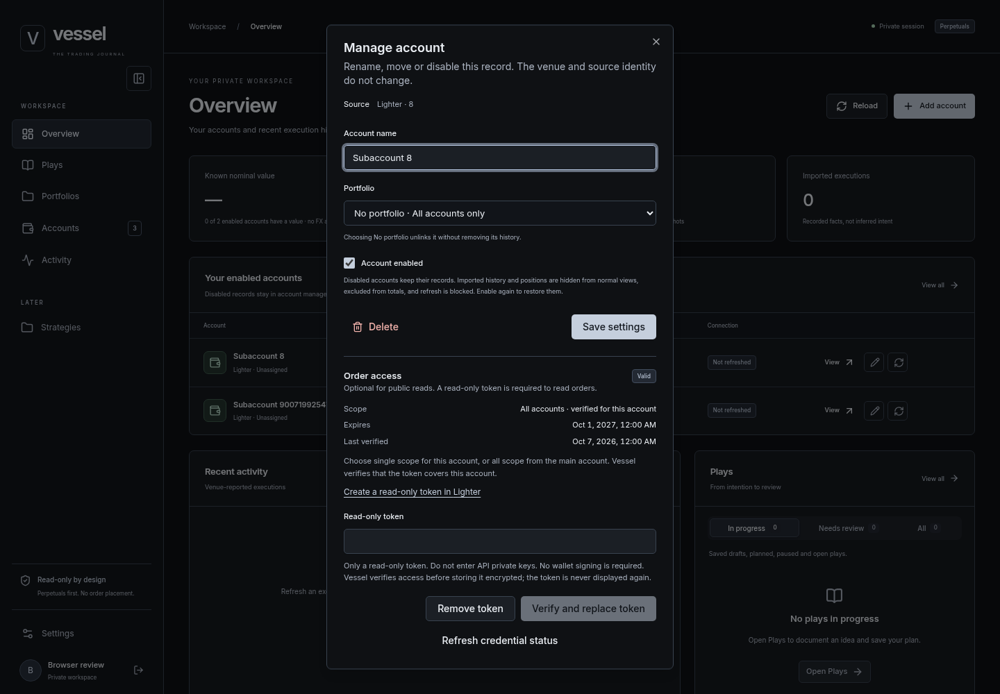
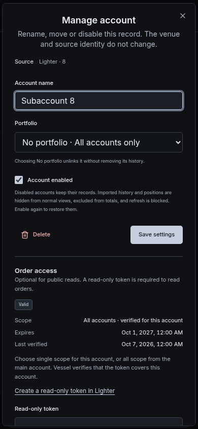

# Lighter implementation

October 7, 2026. The owner authorized this work after RISEx, including the account-import UI and encrypted credential storage. See the [delivery contract](lighter-delivery-contract.md) and [credential setup](venue-credentials.md).

## Account workflow

1. Choose Lighter in **Add account** and enter a public wallet address.
2. **Find wallet** lists its main account and personal subaccounts with venue-reported collateral and available balance. These are not total equity. Missing balances stay unavailable, and zero is shown as zero.
3. Optionally enter a read-only token and choose **Load Lighter names** before selecting. Lighter requires authentication for account metadata. An all-scope token from the main account loads wallet account names; single scope loads only its own name. Unnamed accounts keep their index labels. The lookup saves nothing and clears the token input. Select accounts, edit their Vessel names and optionally choose a portfolio.
4. Already imported accounts cannot be selected again. Disabled accounts are identified and remain manageable instead of being duplicated.
5. Optionally follow the token-creation link and enter an all-scope read-only token issued for the main account. Re-enter it if a name lookup cleared it. Vessel verifies each selected account separately before saving order access.
6. Import creates records, not a history backfill. Open an account and choose **Refresh account** to fetch its current state and bounded recent fills.

One concrete Lighter account index corresponds to one Vessel account. Indices stay strings, including values beyond JavaScript's safe integer range. A failed token save does not remove a successfully imported account. The dialog reports individual outcomes and explains how to retry through account management.

**Manage account** shows token scope, expiry, last verification and status. Replacement requires another venue verification. Removal requires confirmation and retains imported facts. Disabled accounts retain their encrypted credential but cannot use it for venue reads.

The browser blocks token entry on plain HTTP outside loopback hosts. Password fields clear after attempts or closing and are not saved in browser storage. The backend stores only an AES-GCM envelope and non-secret metadata. Server-side key setup, rotation and backup procedures are in [venue-credentials.md](venue-credentials.md).

## Venue coverage

| Read | Current boundary |
| --- | --- |
| Discovery | Main account and personal subaccounts from the public L1-address lookup; no pool import or wallet signing. |
| Catalogue | Active perpetual markets only; ticks, maximum leverage and maintenance fractions come from venue metadata. Retired identities are retained for interpreting existing facts, not offered for new plans. |
| Snapshot | USDC perpetual account equity and reported positions. Position initial-margin requirements use reported notional and margin fraction. Withdrawal availability stays unknown; no separate spot-wallet balance is added. Non-USDC collateral and binary positions are unsupported. |
| Fills | At most five pages of 100 recent records. Only verified fee-free executions with reported realized PnL are accepted. Omitted or unverified values are never silently replaced with zero. Liquidation, deleverage, settlement and self-trade records are unsupported and omitted rather than failing the refresh. The account's history notice reports omissions and limits. |
| Orders | Verified read-only token required. Up to 1,000 active records and five pages of 100 inactive records. Zero-size, flagged and TWAP orders are omitted rather than guessed. |
| Candles | One bounded manual request, at most 500 candles. Native intervals are 1m, 5m, 15m, 30m, 1h, 4h, 12h and 1d. No trade-count value is fabricated. |
| Market context and streaming | Not advertised or implemented for Lighter. No invented funding rate and no generic stream-relay refactor in this delivery. |

Requests share a process-local two-operation concurrency limit. Queue time is inside each operation's 20-second deadline. There is no rate-limit retry loop. An authentication refusal for history can fall back to public history once; if public history is also refused, the public snapshot still refreshes with an explicit notice. Malformed financial data remains a failure.

The October 5 investigation described Standard accounts as fee-free. The October 7 verification found fee-bearing cases, including Standard TWAP. Import checks the relevant fee fields and authenticated tier information where available. It does not label every discovered account Standard or every omitted fee field zero.

The refreshed checks used the official [trade schema](https://apidocs.lighter.xyz/reference/trades.md), [account tiers](https://apidocs.lighter.xyz/docs/account-types.md), [candle schema](https://apidocs.lighter.xyz/reference/candles.md), [account discovery](https://apidocs.lighter.xyz/reference/accountsbyl1address.md) and [margin calculations](https://docs.lighter.xyz/trading/liquidations-and-llp-insurance-fund.md). These are the evidence for the differences from the older investigation.

## Identity and migrations

- `AccountSourcesAndCredentials` backfills `SourceId` from existing addresses, replaces the source-uniqueness index, adds the owner-bound credential table and records native position contract IDs. EVM API clients can still send `address`.
- `HyperliquidCanonicalInstruments` converts the verified `kPEPE`, `kSHIB`, `kBONK`, `kLUNC`, `kFLOKI`, `kDOGS` and `kNEIRO` aliases to `1000…` keys. Imported facts retain their native contract IDs. REST, chart streams and external trade links convert back to the venue's native identifier.
- Typed Hyperliquid drawing keys are migrated even when a Play has since selected a different venue. Manual instrument text, notes, revision content, other-venue keys and order-link IDs are not rewritten.
- Conflicting drawing keys or native identities abort the migration instead of overwriting evidence. The canonical data migration cannot be rolled back automatically; restore a backup if reversal is required.

Apply migrations explicitly during deployment. Testing used a disposable PostgreSQL instance, not the mounted application database.

## Verification

October 8 follow-up: the public [discovery schema](https://apidocs.lighter.xyz/reference/accountsbyl1address.md) supplies `collateral` and `available_balance`; the separate [metadata schema](https://apidocs.lighter.xyz/reference/accountmetadata.md) supplies `account_index` and `name`. A bounded unauthenticated metadata probe returned HTTP 400 with the missing-authorization error. Authenticated name lookup is fixture-tested; no real user token was supplied.

The follow-up passed 755 backend tests with 63 opt-in database/live tests skipped, all 510 frontend tests, type checking, lint and production build. The existing Vite chunk-size warning remains. Desktop and mobile fixture flows passed with no page errors, no horizontal overflow, no token in browser storage, and no scoped axe WCAG A/AA violations. The import recording and screenshots now show names and separate balances.

- The final `pnpm check` passed 2 Python, 76 prototype, 800 backend and 503 frontend tests, plus types, lint and production build. PostgreSQL and the Lighter public mainnet test were enabled. The separate opt-in RISEx live test was skipped. Vite reported its existing non-failing chunk-size warning.
- Credential coverage includes tamper rejection, owner/account/purpose binding, key rotation, key-file permissions, safe errors, owner isolation, deletion cascades and credential-versus-sync/disable locking. System metadata remains available without a database connection.
- Adapter fixtures cover exact IDs, token scope, fee/PnL guards, catalogue collisions, retired markets, pagination, order normalization, candle bounds and authentication fallback.
- The opt-in public mainnet test covers the catalogue, an empty system-account snapshot and bounded candles. No real user read-only token was supplied; authenticated order and token-verification flows were tested with controlled responses.
- Browser checks used the actual frontend with synthetic API responses at 1440×1000 and 390×844. They covered disabled duplicates, partial token failure, indices beyond the safe integer range, no automatic refresh, token removal confirmation and empty browser storage. Both import and management dialogs passed the scoped axe WCAG A/AA checks after their opening animations completed.

### Browser evidence

These are synthetic review accounts, not the owner's balances or credentials.

