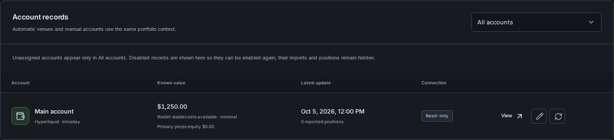
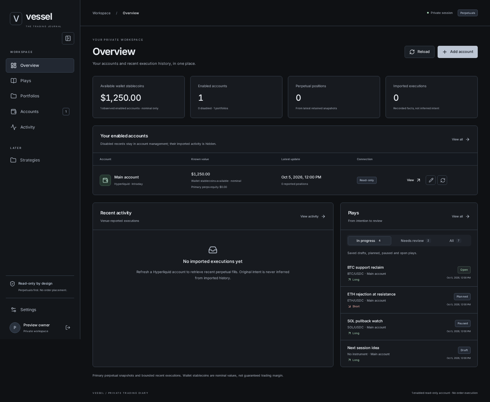
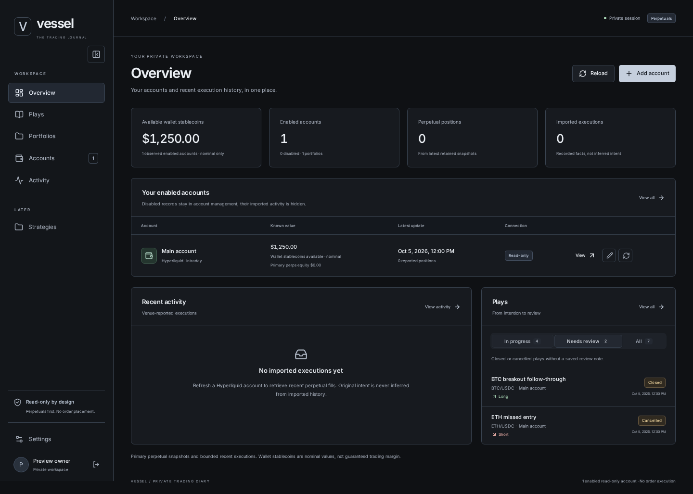
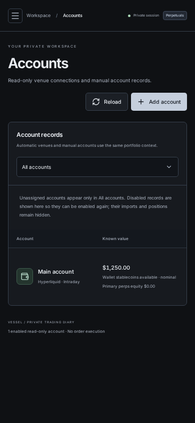
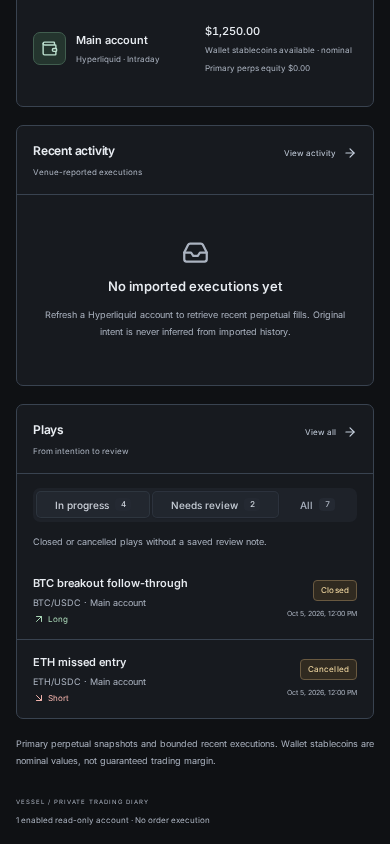

# Overview plays and account alignment

October 5, 2026. Screenshots of the production build using synthetic preview
accounts and saved Plays, not a live venue connection or private account data.

## Behavior

- The Accounts portfolio filter is centered against the header copy, with a
  consistent width and an inset chevron. On small screens it occupies its own
  full-width row. It remains a native, keyboard-accessible select.
- The Overview placeholder is replaced by saved Plays from the existing
  owner-scoped `/api/plays` endpoint:
  - **In progress**: saved Draft, Planned, Paused and Open Plays.
  - **Needs review**: Closed or Cancelled Plays without a nonblank saved review note.
  - **All**: all saved Plays, including reviewed ones.
- Tabs include counts, support keyboard navigation and retain a bounded,
  scrollable list. Plays sort by their latest update.
- A row opens its saved Play. Reopening the current Play retains local edits;
  opening another while edits are unsaved goes to the existing save/discard flow.
- Reload refreshes the panel. Loading, retryable failures and empty states are
  separate; a failed Play read does not hide accounts or recent activity.

The additive `hasReview` summary field reports the existing review note's presence.
It does not introduce the later versioned review subsystem or change lifecycle,
execution matching or account scope. No database migration is required.

## Verification

- 76 prototype tests, 623 backend tests (including isolated PostgreSQL tests;
  none skipped), and 397 frontend tests passed.
- Locked dependency restore, TypeScript, ESLint and production builds passed.
- Headless Chromium checks at widths 320, 390, 550, 768, 1001, 1024, 1100, 1280
  and 1440 verified no page overflow or clipped tab controls.
- Browser interactions verified filters, direct Play opening, draft preservation,
  independent failures, retry and empty states. No JavaScript page errors.

## Screenshots

### Account header — desktop

### Overview — In progress

### Overview — Needs review

### Mobile

