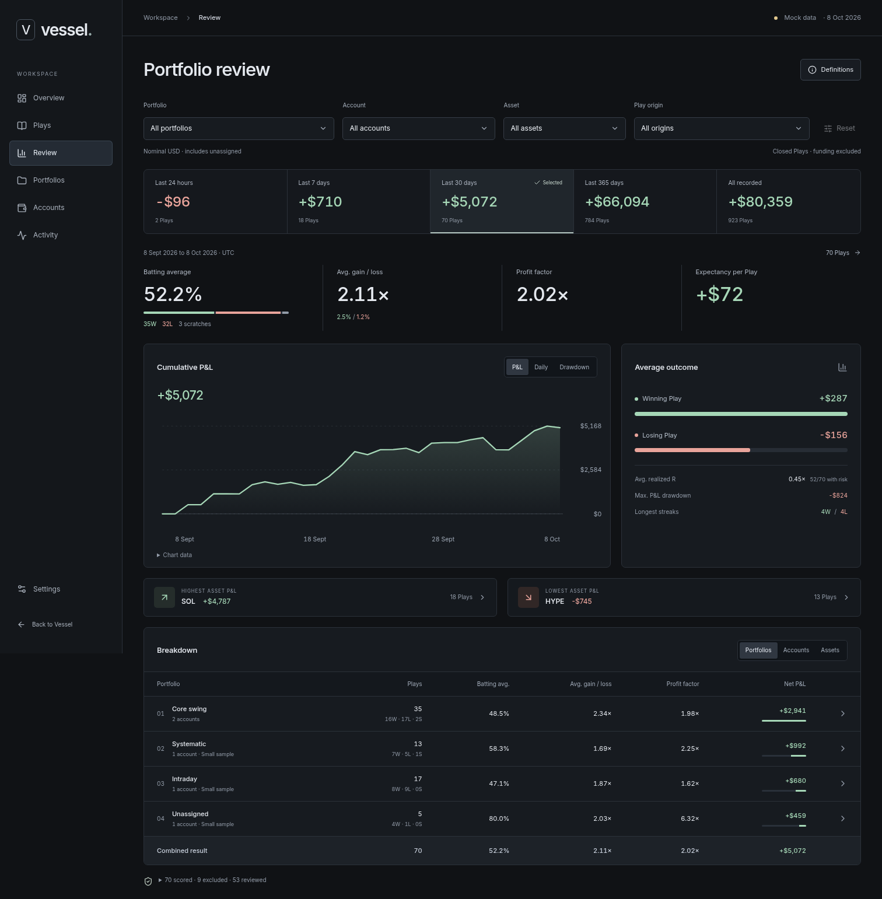
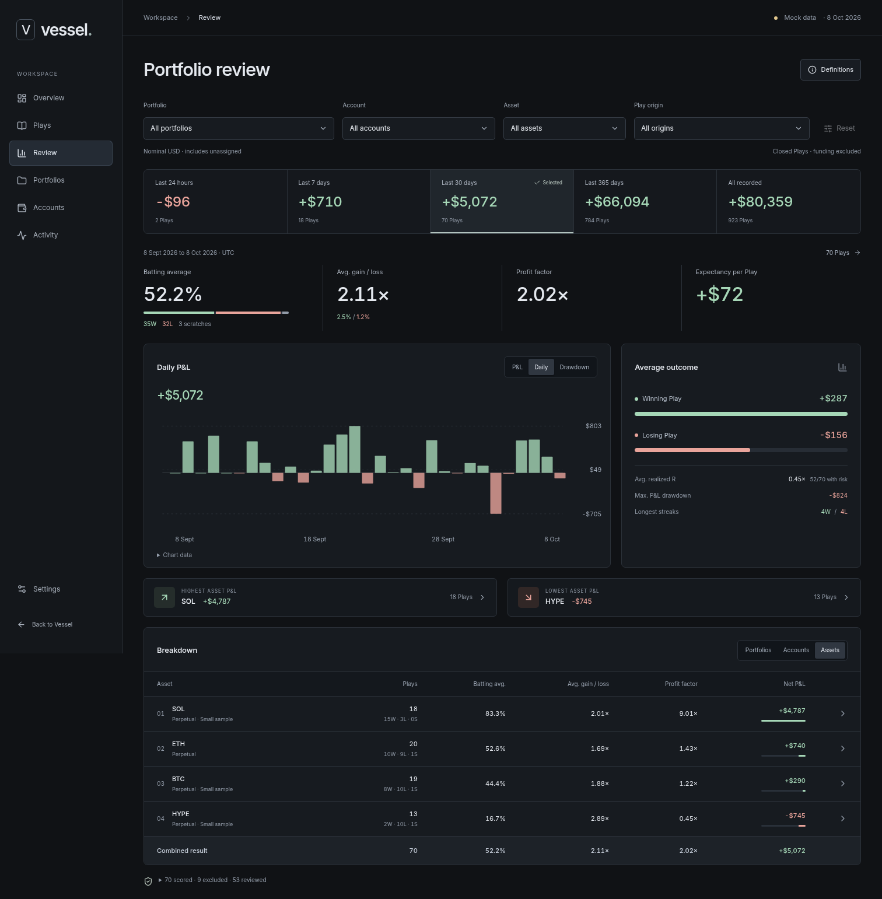
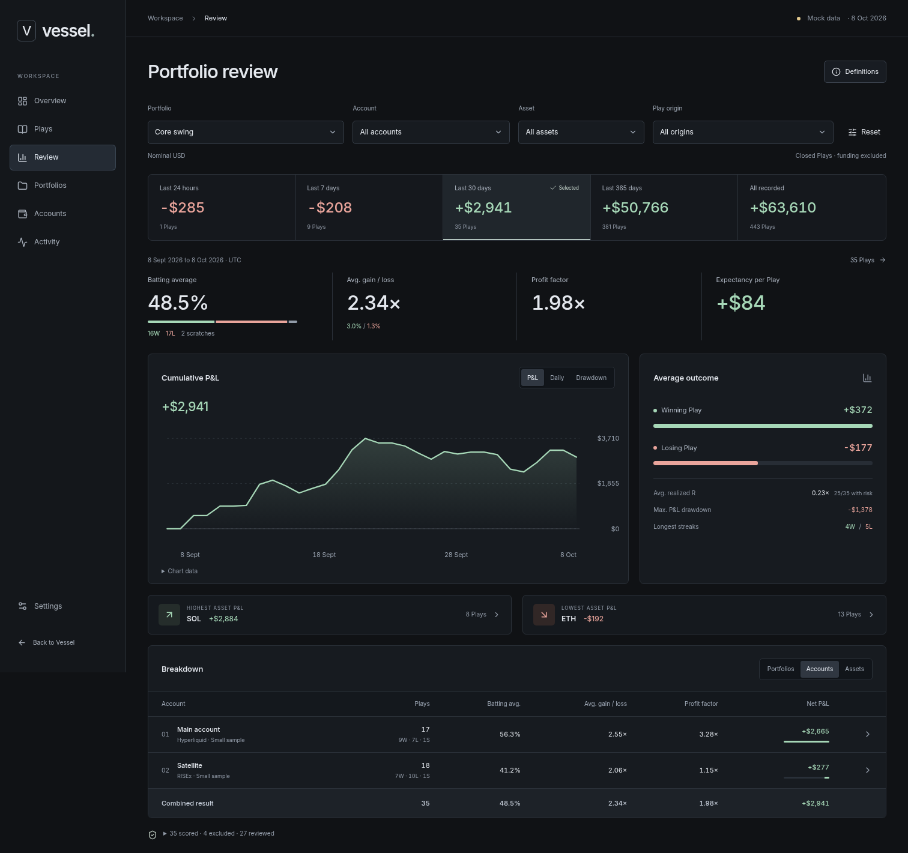
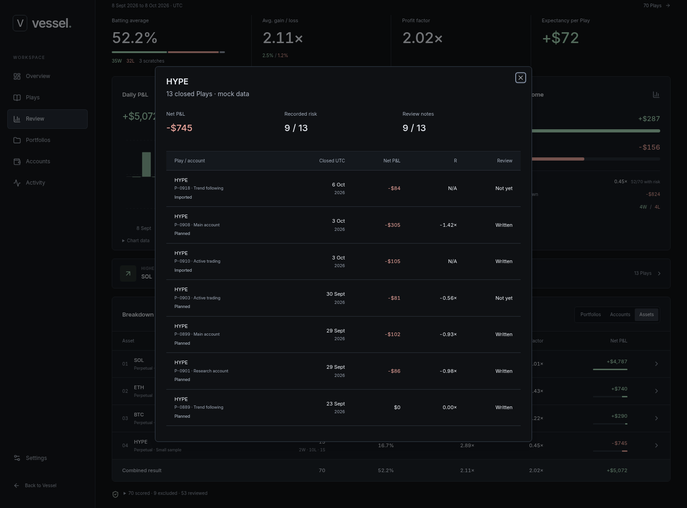
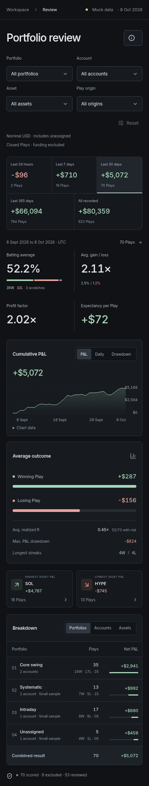

# Portfolio review proposal

October 8, 2026. Initial design proposal requested by the owner.

October 9: the owner approved implementation. The production Review page now
uses the real reporting API; see the
[implementation contract](../../architecture/portfolio-review.md) and
[production captures with synthetic verification data](implementation/).
This document and the standalone proposal retain the original mock scope,
including the origin filter. Production cannot yet score unassigned imported
fills as retrospective Plays and does not offer that filter.

## The proposed page

Add **Review** after Plays in the application navigation. Keep the approved
Graphite appearance and leave the Play workspace unchanged.

This is a portfolio performance scorecard, not a score out of 100 and not a
replacement for a trader's written review of an individual Play. Winning does
not establish that a decision was good. The initial page answers:

- What did this selection make or lose over a day, week, month, year and all
  recorded history?
- How often did it win, and were its winners large enough relative to its losers?
- Which portfolios, accounts and assets contributed most and least?
- Which actual closed Plays produced those numbers?
- How complete is the underlying record?

### Reading order

1. Portfolio, account, asset and Play-origin filters.
2. Five P&L tiles, also used to select the active period. All use the same
   filters, so they can be compared without changing scope.
3. Four headline statistics: batting average, average gain/loss ratio, profit
   factor and expectancy per Play. Win, loss and scratch counts are visible.
4. A cumulative closed-play P&L chart, switchable to daily results or
   daily-closing P&L drawdown. An adjacent average-outcome chart compares the
   dollar size of winners and losers, with realized R, drawdown and streaks.
5. Highest and lowest asset P&L, with sample counts and direct filtering.
6. One ranked table, switchable between portfolios, accounts and assets.
   Each row opens its contributing Plays. The combined row is computed from
   individual outcomes, never an average of the displayed percentages.
7. Coverage and written-review counts. Detailed definitions open on demand.

The owner's text-cleanup pass removes taglines, repeated metric explanations
and the decorative footer. Definitions and expandable coverage retain the
calculation rules. Native dropdowns use centered inset chevrons; selectors and
Reset share a 39-pixel height, and segmented buttons share a 28-pixel height.

There are no decorative gauges, arbitrary grades, trading recommendations,
automatic changes to sizing or new chart dependencies. Native SVG draws the
charts; a text table provides the daily values. Mobile keeps all five periods
visible and prioritizes name, Play count and P&L in the breakdown.

## Working preview

The separate Vite entry is `frontend/review-proposal.html`, with code in
`frontend/src/design/portfolio-review/`. It does not change the authenticated
application, navigation, APIs, database, or existing disposable Play prototype.
It is not included as an entry in the normal production build.

From the repository root:

```sh
corepack pnpm install --frozen-lockfile
corepack pnpm --filter vessel-frontend dev --host 127.0.0.1 --port 5186
```

Open `http://127.0.0.1:5186/review-proposal.html`. For an explicitly shared LAN
preview, use `--host 0.0.0.0` and the host's LAN address.

The deterministic fixture contains 923 scored closed Plays across three
portfolios, five accounts including an unassigned account, and four assets.
It includes planned and imported origins, varied position sizes, scratches,
missing imported risk and missing written reviews. Nine additional records
demonstrate exclusions: four unresolved imports, three open records and two
closed records with incomplete fees.

The clock is frozen at **October 8, 2026, 18:00 UTC**. The default 30-day view
has 70 scored Plays, 35 wins, 32 losses, 3 scratches and a rounded net result
of +$5,072. Every tile, chart, metric and breakdown comes from the same fixture.
These are invented records, not a backtest or a live account.

## Proposed counting rules

Follow the established [Play lifecycle](../../architecture/play-lifecycle.md),
[normalized execution facts](../../architecture/execution-facts.md) and
[sizing track record](../../architecture/sizing-suggestions.md). This proposal
does not change those contracts.

| Metric | Proposed definition |
| --- | --- |
| Closed-play P&L | A Play's executed net result, attributed to its final close time. Deduct execution fees once, according to each fill's `PnlBasis`. Exclude funding until it can be attributed reliably. |
| Outcome | Positive net result is a win, negative is a loss, exact zero is a scratch. Count a Play once, not once per fill or entry. |
| Batting average | Wins / wins plus losses. Scratches are shown separately. |
| Play return | Net result / executed entry notional. Not return on margin, leverage or account equity. |
| Average gain/loss ratio | Mean positive Play return / absolute mean negative Play return. Both underlying means are displayed. |
| Profit factor | Sum of winning net results / absolute sum of losing net results. This is distinct from the return ratio. |
| Expectancy | Net result / all scored closed Plays, including scratches. Descriptive sample mean, not a forecast. |
| Realized R | Net result / known initial planned risk. Show the risk-known count; never infer risk retrospectively from an imported result. |
| Max. P&L drawdown | Largest drop from a preceding peak in cumulative closed-play results, starting at zero for the selected period. Computed per Play, not per day. This is not account-equity drawdown. |
| Drawdown chart | Daily closing cumulative P&L below its previous daily closing high. Intraday drops can be absent from this chart, so its minimum can differ from the per-Play maximum drawdown metric. |
| Streaks | Consecutive winning or losing Plays ordered by close time. Scratches do not break the streak. |
| Written reviews | Count of scored Plays with a written review. Does not claim plan adherence or decision quality. |

Missing denominators are **N/A**, including an all-winning sample's profit
factor. Empty selections do not become $0 performance. Groups with fewer than
20 results carry a small-sample label, a UI caution rather than a claim of
statistical significance.

### Time, scope and coverage

- Proposed initial windows are rolling 24 hours, 7 days, 30 days and 365 days.
  The lower boundary is exclusive; the snapshot upper boundary is inclusive.
  Display UTC and the actual dates. Calendar month/year or a custom range
  can be added if preferred.
- **All recorded** means retained, covered history. It must not promise
  lifetime performance from bounded venue refreshes.
- The initial proposal groups by the account's current portfolio membership.
  Moving an account would move its historical results between portfolio
  views. Historical portfolio membership would require a separate rule and
  history; it must not be implied.
- All portfolios includes enabled unassigned accounts once, visibly identified
  as unassigned. Disabled accounts are excluded consistently with current
  account activity scope.
- Filtered aggregate results are recomputed from underlying outcomes. A
  small portfolio and a large portfolio do not receive equal weight merely
  because they each occupy one table row.
- Group assets by canonical instrument identity, preserving contract
  multipliers and venue provenance. The demo's simple asset strings do not
  implement production identity mapping.
- Only combine compatible result currencies. This fixture uses nominal USD.
  Production must expose stablecoin assumptions and separate incomparable
  currencies, rather than silently treating every currency as USD.
- The sample excludes incomplete fees from the scored cohort and reports
  their count. This is stricter than the current sizing record, which can
  expose `feesComplete: false`. The reporting policy needs confirmation and
  must not silently alter sizing behavior.

### Imported Plays

An imported fill is not automatically an imported Play. Retrospective closed
Plays require a confirmed grouping with adequate opening and closing history.
Ambiguous links, unknown opening inventory and overlapping Plays cannot be
resolved by grouping only on account and instrument.

The proposed imported cohort retains provenance without inventing a thesis,
strategy, stop or original risk budget. A result represented through both an
import and a saved Play must count once through stable execution links.
The fixture demonstrates the intended confirmed-import experience; it does
not establish that retrospective import construction is implemented today.

### Closed-play P&L versus daily realized P&L

The proposed scorecard consistently uses the closed-Play cohort. It assigns
the whole result to the final close, including earlier partial exits. It
therefore does **not** answer "how much was realized by executions yesterday"
when those executions belong to still-open Plays.

If that cash-ledger question is wanted too, add a separately named realized
execution P&L view with exit timestamps and its own fee/funding rules. Do not
mix that series with closed-Play batting statistics and present them as the
same population.

## Suggested implementation after design approval

1. Extract or reuse the application-layer closed-Play outcome calculation
   used by sizing. Keep its 20-decided-Play sizing window independent from
   these reporting windows. Preserve normalized fee/P&L facts and exact
   decimal strings. The fixture's JavaScript arithmetic is not a production
   accounting implementation.
2. Add owner-scoped, read-only reporting queries for filtered summaries,
   period totals, dated series, group breakdowns and contributing Play IDs.
   Return coverage boundaries, exclusion reasons, a common snapshot time
   and currency basis with the numbers. Test no double counting, account
   moves/disabling, multi-entry Plays and ambiguous imports.
3. Mount the approved page in the existing shell, replacing fixtures with
   those queries and links to saved Plays. Include loading, retry, partial
   coverage and no-data states. Keep the existing Play editor and layout intact.
4. Integrate confirmed retrospective imports once their construction and
   deduplication contract is implemented. Do not turn arbitrary activity rows
   into scored Plays as a shortcut.

Useful later additions are direction and strategy comparisons once their
metadata is reliable, fee drag, holding-time distributions and custom dates.
Account-equity returns, return percentages for a portfolio, time-weighted
returns and Sharpe/Sortino ratios need appropriate balance, cash-flow,
valuation and coverage histories. They are deliberately absent here.

The main choices to confirm are the layout, rolling versus calendar periods,
and whether the initial P&L view should be closed-Play results or an additional
realized-execution ledger. No production backend is changed by this proposal.

## Verification and captures

The unit tests cover metric definitions, zero and missing denominators,
scratches, risk coverage, exact UTC bounds, pooled aggregation and agreement
between charts, tiles and breakdowns. Component tests cover filtering,
dependent account reset, dialog focus, chart switches and empty results.

```sh
corepack pnpm --filter vessel-frontend test src/design/portfolio-review
corepack pnpm --filter vessel-frontend build
corepack pnpm --filter vessel-frontend lint
```

`scripts/review-proposal-smoke.cjs` uses an external Playwright installation.
Set `PLAYWRIGHT_MODULE` to that module path and, when needed, `CHROMIUM_PATH`
to a working browser. `REVIEW_PREVIEW_URL` defaults to the preview above.
It checks responsive widths from 320 to 1512 pixels, controls, period-total
agreement, dialog bounds and focus restoration. It rejects JavaScript page
errors and any `/api/` requests, and regenerates the captures below.

Verified on October 8, 2026:

- 450 frontend tests passed, including 26 new proposal tests.
- TypeScript, ESLint and the production build passed. Vite still reports the
  main application's bundle-size advisory. The proposal is absent from its
  production JavaScript.
- Browser checks passed at 320, 390, 540, 768, 1024, 1280 and 1512 pixels,
  with no document overflow, page exceptions or API requests. The checks also
  verify dropdown-arrow centering, Reset alignment and equal control heights.
- Desktop and mobile axe checks reported no WCAG A/AA violations. Some
  contrast and ARIA checks remained marked for manual review; this is not
  a claim of full accessibility conformance.
- The T3 collaborative preview host was unavailable, so browser verification
  and captures used the available local Chromium through Playwright.

### All portfolios



### Asset comparison and daily results



### One portfolio, split by account



### Contributing Plays



### Mobile


